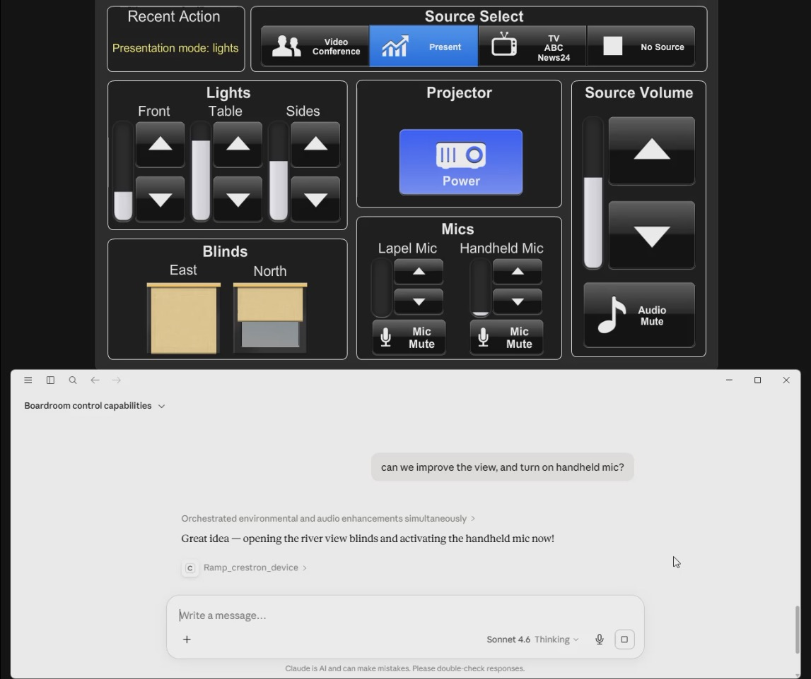

# MCP for Crestron client

Control a Crestron 4-Series AV system from Claude, in natural language. This is the
client half of [MCP for Crestron](https://solutionav.com.au/crestron-mcp/): an MCP server
that connects Claude (Desktop or Code) to a processor running the MCP for Crestron modules,
exposing the system as MCP tools over stdio. It speaks the MCP for Crestron text protocol
(see [`PROTOCOL.md`](PROTOCOL.md)) over TCP, with secure-key + TLS authentication.

[](https://solutionav.com.au/crestron-mcp/)

*Talk to your Crestron system in plain English. [Watch the full demo (1:19) »](https://solutionav.com.au/mcp-for-crestron/media/mcp-for-crestron-demo-full.mp4)*

The client is **free**. Controlling a processor requires that processor to be licensed
(or on a free trial). See [Licensing](#licensing). One processor licence is AUD $249
(inc GST); each processor also gets three free 1-week trials. Get a licence at
<https://solutionav.com.au/crestron-mcp/>.

## Install

### Claude Desktop (recommended)
Download `mcp-for-crestron.mcpb` from <https://solutionav.com.au/crestron-mcp/> and open it
(or Settings → Extensions → Install). Enter the processor's address and its secure key
(shown on the MCP Server Config module's `Key` output); the port defaults to `50794`.

### Claude Code / other MCP hosts
No download needed. Run it straight from npm:

```bash
claude mcp add crestron \
  --env CRESTRON_HOST=10.0.1.38 \
  --env CRESTRON_KEY=<the processor's secure key> \
  -- npx -y mcp-for-crestron
```

## Configuration

Resolved low-to-high: `config.json` next to the entry, environment variables, then CLI
args (`<host> [port]`).

| Env | Meaning |
| --- | --- |
| `CRESTRON_HOST` | processor IP / hostname (required) |
| `CRESTRON_PORT` | TCP port (default `50794`) |
| `CRESTRON_KEY`  | secure key (mode 2); enables TLS + authentication |
| `CRESTRON_AUTH` | password (mode 1 only) |
| `CRESTRON_TLS`  | force TLS without a key |

## Tools

`discover_crestron_system`, `list_crestron_rooms`, `list_crestron_devices`,
`query_crestron_device`, `get_crestron_time`, `control_crestron_device`,
`set_crestron_devices`, `pulse_crestron_device`, `ramp_crestron_device`,
`cancel_crestron_device`, `get_room_status`, `activate_crestron_license`,
`get_crestron_license_status`, `start_crestron_trial`.

See [`AGENT_GUIDE.md`](AGENT_GUIDE.md) for how an assistant should use them (timing,
scenes, ramps, nudge-not-nag licensing etiquette).

## Licensing

The processor must be licensed before it accepts control or query commands. If it isn't,
every tool returns guidance that includes the processor's **activation code (its MAC)**.
Two ways forward, both in chat:

- **Free trial**: `start_crestron_trial` (no payment; up to 3 × 1 week per processor).
- **Buy**: get a key for that MAC at <https://solutionav.com.au/crestron-mcp/>, paste it
  in chat, and the assistant calls `activate_crestron_license`.

The licence is stored **on the processor** (bound to its MAC), so it persists across
reboots and covers every client. A purchased key only works on that one processor, so it's
safe to receive in chat.

## Develop

```bash
npm install
npm run build      # tsc -> dist/
npm start          # node dist/index.js
npm run mcpb       # build the Claude Desktop .mcpb (needs bun)
```

## License

MIT. See [`LICENSE`](LICENSE). (The client is open; the product is the per-processor
licence on the box.)

## Trademark

Crestron is a registered trademark of Crestron Electronics, Inc.; MCP for Crestron is a
product of Solution AV Automation, not affiliated with or endorsed by Crestron.
